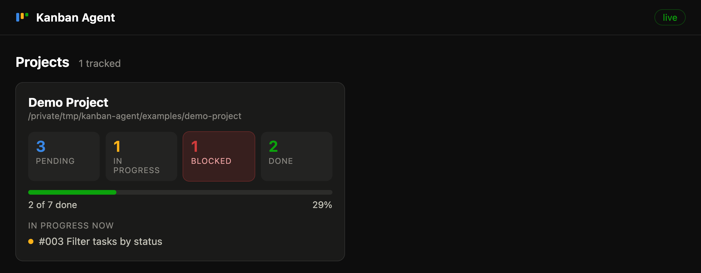
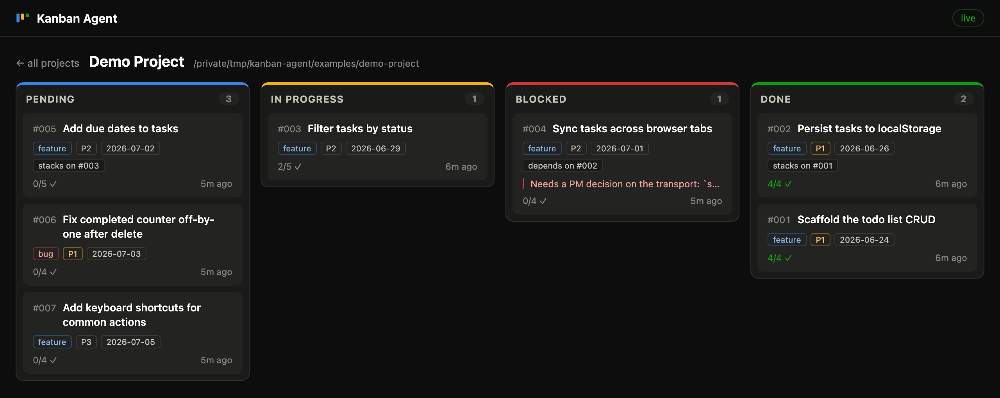
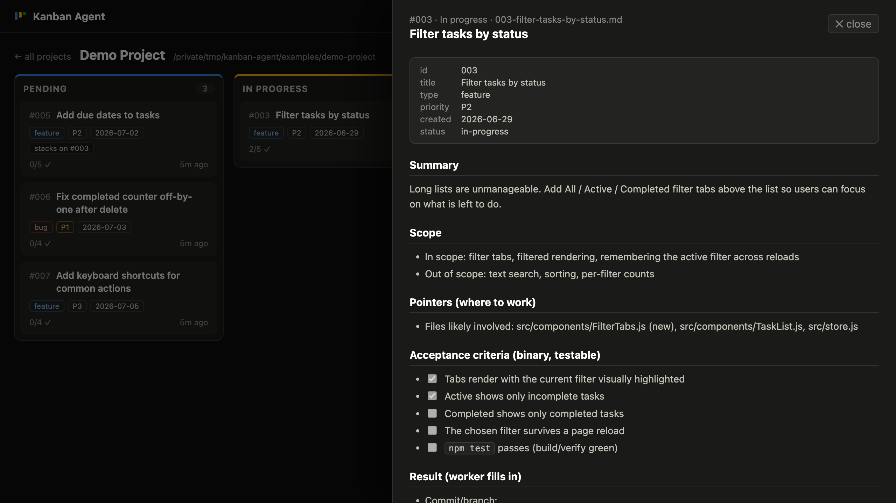

# Kanban Agent

[](LICENSE)

File-based kanban for coding-agent fleets. A PM agent writes markdown work
items into `work-items/pending/`, worker agents claim them with `git mv`, and
the folder a file sits in **is** its status — no database, no service, no
lock server. The repo is the queue, git is the lock, and any agent (Claude
Code or otherwise) or any human with a file manager can operate it. On top of
the convention sit a zero-dependency live dashboard (the **cockpit**) and an
**MCP server** that attaches the workflow to any project and drives the queue
through tools.



## Why

When several coding agents work a backlog in parallel, the coordination layer
usually becomes the hard part: a ticket API to integrate, a database to host,
credentials to distribute. Kanban Agent removes that layer instead of adding
to it:

- **Plain files** — a work item is a markdown file; its folder is its status.
  Every agent can read and write files; no SDK required.
- **Git is the lock** — claiming an item is `git mv pending/007-… in-progress/007-…`.
  Two workers cannot both win the move, and history doubles as an audit log.
- **Reviewable backlog** — items travel with the code. Specs, acceptance
  criteria and results are diffable, greppable and PR-reviewable.
- **Watchable** — the cockpit tails every queue on the machine over
  `fs.watch` + SSE, so you can watch a fleet burn down a backlog live.

## Quickstart

```sh
git clone https://github.com/gak4u/kanban-agent.git
cd kanban-agent
npm start            # → http://localhost:4400
```

Requires Node ≥ 20. Zero npm dependencies, no build step. On first start the
server seeds `projects.json` from `projects.example.json`, which points at the
bundled [`examples/demo-project`](examples/demo-project) — so you get a
populated board out of the box. Edit `projects.json` to track your own
projects.

## The convention

Each tracked project has a `work-items/` directory at its root
(full spec: [`docs/convention.md`](docs/convention.md)):

```
work-items/
  pending/        NNN-slug.md   ← ready to be picked up
  in-progress/    NNN-slug.md   ← claimed by a worker
  blocked/        NNN-slug.md   ← stuck; has a "## Blocked" note
  done/           NNN-slug.md   ← finished + verified
  _TEMPLATE.md  README.md  WORKER_PROMPT.md  _artifacts/   ← not work items
```

- **Folder = status.** Files carry a `status:` frontmatter field but it goes
  stale; the folder is always authoritative.
- **`NNN` ordering.** Items are `NNN-slug.md` with a zero-padded number that
  is allocated once across all four folders — it doubles as FIFO/priority
  order. Workers always claim the lowest-numbered pending item.
- **Frontmatter fields** (all optional, parsed leniently): `id`, `title`,
  `type` (`feature|bug|chore`), `priority` (`P1|P2|P3`), `created`
  (`YYYY-MM-DD`), `status`, `depends_on` / `stacks_on` (item number),
  `needs_migration` (bool).
- **Claim protocol.** A worker claims an item by moving it:
  `git mv work-items/pending/NNN-slug.md work-items/in-progress/` — the move
  is the lock; never touch a file already in `in-progress/`. Finished items
  get their `## Result` section filled and move to `done/`; stuck items get a
  `## Blocked` note and move to `blocked/`.

## The cockpit

A read-only web dashboard over every queue on the machine:

- **Overview** — one card per project: per-status counts, done-vs-total
  progress, what is in progress right now; blocked counts light up when > 0.
- **Board** — four kanban columns per project, cards ordered by item number
  (Done newest-first) with type/priority badges, acceptance-criteria progress,
  `stacks_on`/`depends_on` chips and last-activity time.
- **Item drawer** — click a card for the rendered markdown, with frontmatter
  as a key/value header (a stale frontmatter `status` is flagged).
- **Live** — the server watches the status folders (`fs.watch`) and pushes
  refreshes over SSE; the UI falls back to 10-second polling if SSE fails.





The server binds to 127.0.0.1 only (localhost tool, no auth) and never writes
to tracked projects. API: `GET /api/projects` (all queues, parsed),
`GET /api/item?project=&status=&file=` (one item, raw + rendered),
`GET /api/events` (SSE refresh stream).

## The MCP server

`mcp/server.js` is the write side: it attaches the workflow to any project and
operates queues from any MCP client (sole dependency:
`@modelcontextprotocol/sdk`).

```sh
cd mcp && npm install        # once
claude mcp add --scope user kanban-agent -- node /path/to/kanban-agent/mcp/server.js
```

(`claude mcp list` should then show `kanban-agent … ✔ Connected`.)

### Hosted mode (one server for a team)

The same tool set can be served over the MCP Streamable HTTP transport so a
team's agents share one server: per-user Bearer tokens (roles `admin` /
`member`), server-managed projects operated by name, `created_by`/`claimed_by`
attribution with completion commits authored as the item's creator (and pushed
to the project's origin), an `/admin` panel for users + projects, and user
chips / an active-claims strip on the dashboard.

```sh
node server/bootstrap.js     # once — creates the user store, prints the admin token
npm run mcp-http             # serves http://0.0.0.0:4401/mcp (port: KANBAN_MCP_PORT)
```

Each user registers the server with their own token (stdio one-liner above
stays the local single-user path):

```sh
claude mcp add --transport http kanban-agent http://<server>:4401/mcp --header "Authorization: Bearer <token>"
```

Reading the cockpit board stays unauthenticated — tokens gate writes and
administration. Architecture, team quickstart, attribution/push flow and ops
notes: **[docs/hosted.md](docs/hosted.md)**.

### Attach the workflow to a project

1. Call `attach_workflow` with the project's absolute path (optionally
   `verify_command`, e.g. `npm test && npm run build`, and `app_url` for
   live checks). It scaffolds
   `work-items/{pending,in-progress,blocked,done,_artifacts}/` with the queue
   `README.md`, `_TEMPLATE.md` and a parameterized `WORKER_PROMPT.md`, and
   appends a `## Work-item queue` section to the project's `CLAUDE.md` (or
   `AGENTS.md`). Idempotent — a second run skips everything that exists.
2. Commit the scaffold in that project.
3. Have a PM agent write items (`create_work_item`, or by hand from
   `_TEMPLATE.md` — the `pm-write-items` prompt sets an agent up for this),
   then spawn workers with the `worker-loop` prompt: claim → implement →
   verify → done, polling until idle.
4. Watch it live in the cockpit — the project auto-discovers if it sits under
   an `autoDiscoverRoots` entry.

### Tools

| Tool | What it does |
| --- | --- |
| `attach_workflow(project_path, project_name?, verify_command?, app_url?)` | Scaffold the queue + agent instructions into a project (idempotent). |
| `queue_status(project_path)` | Per-status counts + `{id, title, file}` lists. |
| `create_work_item(project_path, title, type, priority, summary, scope, …)` | Allocate the next `NNN`, write a fully-specified item into `pending/`. |
| `claim_next_item(project_path)` | Move the lowest-`NNN` pending item to `in-progress/` (`git mv` = the lock) and return its markdown. |
| `complete_item(project_path, id, what_changed, verification, commit?)` | Fill `## Result`, move to `done/`. |
| `block_item(project_path, id, reason)` | Append a `## Blocked` note, move to `blocked/`. |
| `get_item(project_path, id)` | Status + raw markdown, searching all folders. |
| `list_projects()` | Every tracked/discovered project with status counts (hosted mode: the server registry). |

Queue tools accept `project_path` (absolute path, local mode) **or** `project`
(server-managed project name, hosted mode). Admin tools — hosted mode only,
`admin` role required:

| Tool | What it does |
| --- | --- |
| `create_project(name, git_url?)` | Clone or init a git tree under `data/projects/<name>/` + scaffold the queue. |
| `archive_project(name)` | Hide a project from lists; files are never deleted. |
| `create_user(username, email?, role)` | Create a user; returns the one-time API token. |
| `revoke_user(username)` | Invalidate a user's token immediately. |
| `rotate_token(username)` | Issue a new token (returned once), killing the old one. |

| Prompt | What it returns |
| --- | --- |
| `worker-loop(project_path)` | The project's `WORKER_PROMPT.md` — the polling worker loop. |
| `pm-write-items(project_path)` | PM guidance: verify requests, write fully-specified items. |

All writes are confined to `<project_path>/work-items/` (plus the one
instructions append); filenames are validated against `NNN-*.md`, ids against
`\d+` — traversal is rejected.

## Configuration

`projects.json` at the repo root (gitignored; seeded from
`projects.example.json` on first start):

```json
{
  "projects": [
    { "name": "Demo Project", "path": "examples/demo-project" }
  ],
  "autoDiscoverRoots": ["/absolute/path/to/your/projects"]
}
```

- `projects` — explicit list; `name` is what the UI shows. Paths may be
  absolute or relative to the config file.
- `autoDiscoverRoots` — every direct child of these directories that contains
  a `work-items/` folder with at least one status subfolder is added
  automatically (deduped against the explicit list). New projects appear with
  zero config.
- `PROJECTS_CONFIG=/path/to/other.json` — point the cockpit and the MCP
  server at an alternate config. `PORT` overrides the cockpit's port (4400).

## More

- [`docs/convention.md`](docs/convention.md) — the full queue convention.
- [`docs/design.md`](docs/design.md) — how the cockpit and MCP server are built.
- [`CONTRIBUTING.md`](CONTRIBUTING.md) — dev setup and PR guidelines.

## License

[MIT](LICENSE) © 2026 gak4u
